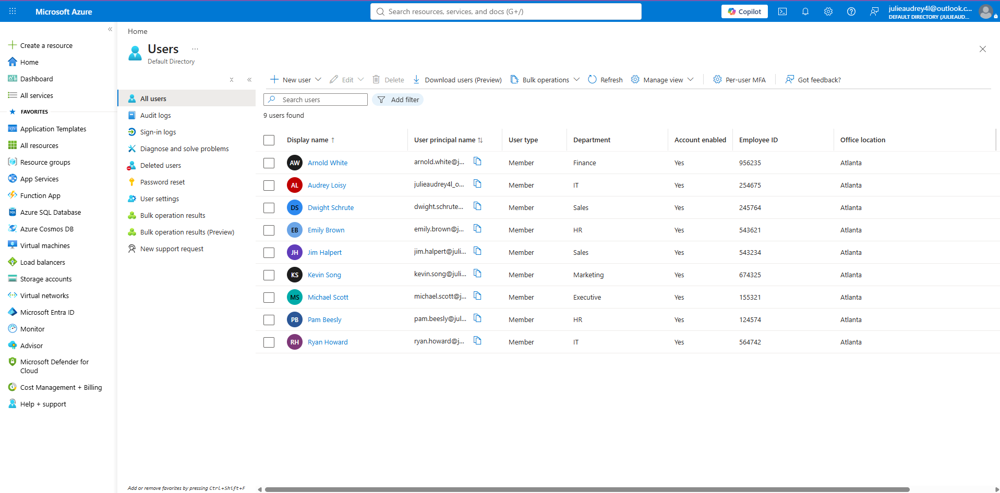
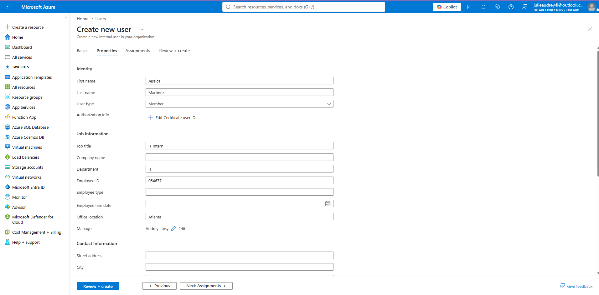
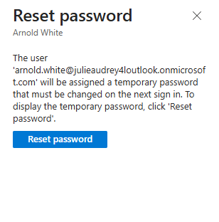
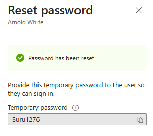

# Microsoft-Entra-ID-User-Lifecycle-Management-Lab
Lab to simulate Microsoft Entra ID onboarding and offboarding processes. 

This project demonstrates how to use Microsoft Entra ID as an administrator to create users, assign users groups, simulate a forced password reset, simulate onboarding and simulating offboarding. The objective of this project is to work through real-world processes as a IT administrator using Entra ID.

##Tools Used - Microsoft Azure (Entra ID)  

##Setup Summary

  1. Visit https://azure.microsoft.com/en-us/pricing/purchase-options/azure-account or portal.azure.com 

  2. Create a free account

  3. In the left menu open Microsoft Entra ID

  4. Choose the Manage drop down, click Users

  5. Click New user > Create a new user (There are two options the option we have chosen today allows for creating/onboarding new users to the organization, our other option "Invite external user" allows us to invite a collaborator from outside to join our organization).

  6. Assign user properties: Employee ID, office location, department, assign managers and groups. This ensures that the users are only accessing what they need to complete their daily objectives in relation to their role in the organization.

  
  8. Reset users passwords: Require all new users to sign in with a temporary password and require password change at next sign in. This allows user accounts and systems to be secure by ensuring account privacy, blocking unauthorized access and stays in compliance with security rules.
     

The expected outcome is that when the user goes to sign into their account, they will be prompted to create a new password used to sign into their account until the password expires due to the age.
